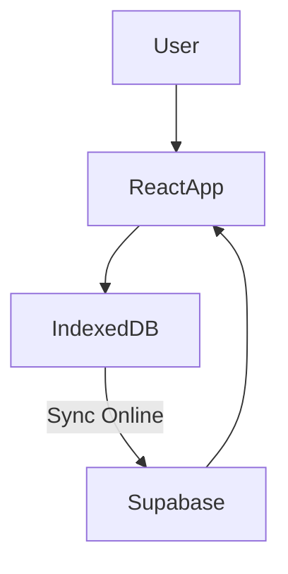

# 🚀 Offline-First CRUD (React + PWA + IndexedDB + Supabase)

Project ini adalah aplikasi **Offline-First** berbasis **React** dengan dukungan **Progressive Web App (PWA)**.
Semua data utama disimpan di **IndexedDB** agar aplikasi tetap bisa berjalan walaupun user sedang offline.
Saat koneksi internet tersedia, data akan **disinkronkan dengan Supabase** sebagai backend utama.

---

## ✨ Fitur Utama

* 🔌 **Offline Support**: Data tetap tersimpan di IndexedDB walaupun tanpa koneksi internet.
* 🔄 **Data Sync**: Perubahan data otomatis di-sync ke Supabase saat online kembali.
* 📱 **PWA Ready**: Bisa di-install ke perangkat mobile/desktop seperti aplikasi native.
* ⚡ **React + Vite**: Build cepat dan modular.
* 🛠️ **Supabase**: Backend untuk autentikasi & penyimpanan data.
* 🗃️ **IndexedDB**: Database lokal untuk menyimpan state aplikasi.
* 📊 **Optimistic UI**: Perubahan langsung terlihat meski offline, lalu dikonfirmasi saat online.

---

## 🏗️ Arsitektur



* **React App** → UI aplikasi utama.
* **IndexedDB** → Penyimpanan lokal untuk mode offline.
* **Supabase** → Cloud database untuk backup & sinkronisasi.

---

## 📦 Tech Stack

* [React](https://react.dev/)
* [Vite](https://vitejs.dev/)
* [Supabase](https://supabase.com/)
* [IndexedDB](https://developer.mozilla.org/en-US/docs/Web/API/IndexedDB_API)
* [Vite PWA](https://vite-pwa-org.netlify.app/) (untuk caching PWA)

---

## 🚀 Instalasi & Menjalankan

### 1. Clone repo

```bash
git clone https://github.com/username/offline-kanban.git
cd offline-kanban
```

### 2. Install dependencies

```bash
npm install
```

### 3. Setup environment

Buat file `.env`:

```env
VITE_SUPABASE_URL=https://xxxx.supabase.co
VITE_SUPABASE_ANON_KEY=your-anon-key
```

### 4. Jalankan di mode development

```bash
npm run dev
```

### 5. Build PWA

```bash
npm run build
npm run preview
```

---

## 🗃️ Penyimpanan Data

* **IndexedDB** → Semua data task/kanban board disimpan di sini terlebih dahulu.
* **Supabase** → Digunakan untuk backup & sinkronisasi data saat online.

### Alur Sync:

1. User buat/update task → Simpan dulu di IndexedDB.
2. Jika online → Data di-push ke Supabase.
3. Jika offline → Data tetap ada di IndexedDB → sinkronisasi otomatis saat online.

---

---

## 🤝 Kontribusi

1. Fork project ini.
2. Buat branch baru (`feature/fitur-baru`).
3. Commit perubahan (`git commit -m 'Add fitur baru'`).
4. Push ke branch (`git push origin feature/fitur-baru`).
5. Buat Pull Request.

---

## 📄 Lisensi

MIT License © 2025

---
